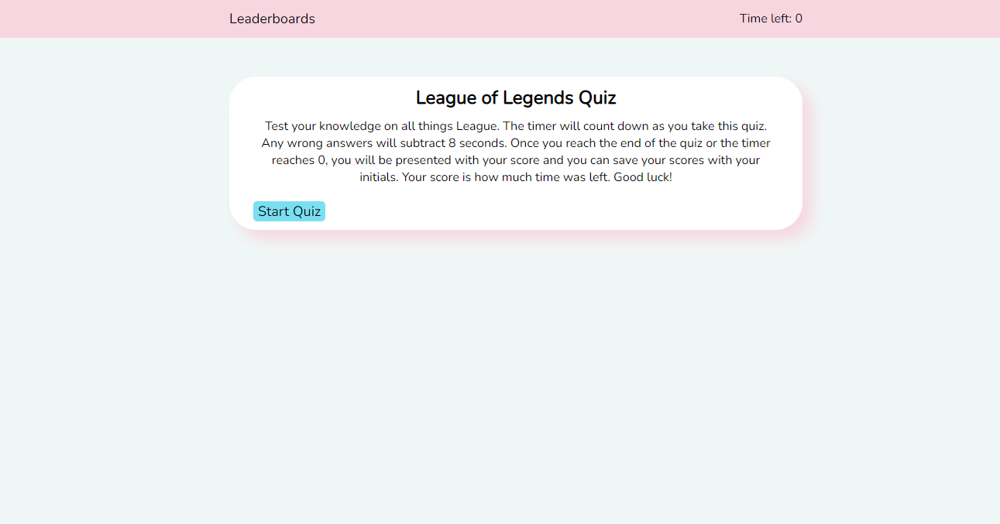

# Project

## Description
This website is a quiz for League of Legends players! On startup you will see a title, paragraph, and a button on the main body and a navbar with a timer and a button that takes you to the leaderboards. If you click the button on the main body that says Start Quiz, the quiz will start and the timer will count down from 100. Answer the ten questions correctly and you will get a score at the end. You can input your name and it will save to the localStorage. On entering your name it will take you to the leaderboards where you can see all your times as well as two buttons. The first is a retry button and the second is a clear leaderboards button.

I wanted to challenge people on this quiz so I made a slightly niche knowledge quiz for the popular game League of Legends. 

I learned a lot about DOM manipulation and I learned a lot about localStorage. I referenced jQuery API a lot!

## Installation
N/A as this is a website.

## Usage
This is a quiz meant to be taken! On startup click start. A question will be presented and click the answer you think is right! When time runs out or you finish the quiz, your score can be posted to a local leaderboards. Whoever uses your browser will see the scores!
Here are some screen shots of the website in action!

## Credits
I used this page a lot to make sure I have the right syntax: https://api.jquery.com

## License
The license is a default MIT license in the LICENSE.md file